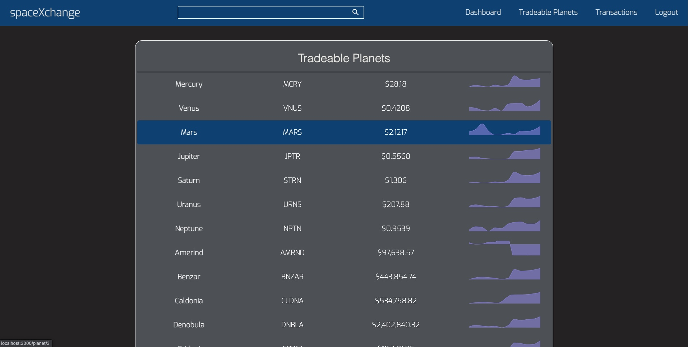

# spaceXchange

_By [[Zaviar Brown](https://github.com/ZaviarBrown), [Ryan Dalton](https://github.com/DaltonR121), [Andrew Moss](https://github.com/aMoss5150), [John Sims](https://github.com/simzeee)_

See ya space cowboy...on [spaceXchange](https://spacexchange.herokuapp.com/)

The galactic empire is being developed as we speak, quickly transforming uninhabitable wastelands into industrial giants, and making a ton of money along the way. spaceXchange is your one stop shop for trading your USD into any other planet's currency, allowing you to take part in the universal stock market.

## Index

- [API Documentation](https://github.com/ZaviarBrown/spaceXchange/wiki/API-Routes)
- [Database Schema](https://github.com/ZaviarBrown/spaceXchange/wiki/Database-Schema)
- [Frontend Routes](https://github.com/ZaviarBrown/spaceXchange/wiki/Frontend-Routes)
- [MVP Feature List](https://github.com/ZaviarBrown/spaceXchange/wiki/MVP-List)
- [User Stories](https://github.com/ZaviarBrown/spaceXchange/wiki/User-Stories)

## Technologies Used

- JavaScript
- React/Redux
- Recharts
- CSS
- Python
- Flask/SQLAlchemy
- Beautiful Soup
- Coingecko API
- Raspberry Pi

## Overview

spaceXchange is a Robinhood clone, created to allow a space-faring civilization to participate in the universal stock market. When a user first accesses the site, they are brought to the splash page, greeting the user and prompting them to signup. Attempting to access any page on the site without login/signup will redirect them to login.

When logging into the site, the user is greeted with their portfolio, allowing them to quickly see the value of all their assets on a graph. They can watch their money move as the market fluctuates and updates in real time. The planet assets are displayed on the right, with the stock chart, the number of shares they own, and the price per share (which also updates in real time). Below the chart the user's buying power is displayed, and further below are recent news stories. These stories are gathered using a python web scraper - Beautiful Soup.

In the navbar we have links to the user's dashboard, a list of all tradeable planets on the site, a list of every transaction made by the user, and a logout button. In the center of the navbar is a search bar, which can search for planets through either their name or stock ticker.

While on an individual assets page, a stock chart for the planet's value is displayed with a timeline legend on the right side. Clicking each of these buttons will display the assets historical data based on a call to the CoinGecko API. Beneath the chart is information about the planet, some key metrics, as well as news stories once again. From this page the user can buy and sell shares, and the price being displayed at the exact moment on-click of either button will be the price that the transaction is made at. This allows users to become master intergalactic day-traders.

The tradable planets page displays every planet currently being tracked by the website. Here, you can see the simulated stock market in full effect. Every price on this page is being fed through a stock algorithm and increasing/decreasing at a randomly chosen percentage value. This percentage value is directly tied to real volatility data for the cryptocurrency that each planet is linked to. A mini stock chart is displayed next to each planet's price, and each planet row is clickable and takes the user to that planet's page.

All user transactions are kept track of and displayed on the transactions page. The most recent transactions are displayed first and buy/sell are color coordinated for easy viewing and organization. Each transaction will take the user to the related planet page when clicked

## HODL Through The Bad Times

Dealing with asynchronous JS proved to be the most difficult part of this project. We found that when chaining .then()'s, if we didn't pass in a callback we were running into occasional errors where the next function to be run in .then() would be undefined. This was happening at random on virtually every .then() chain, so when we finally figured this out it took our site from mostly functioning correctly to always functioning perfectly.

An interesting problem we had to solve was giving our user historical data to render their portfolio stock chart. The issue is the chart is drawn using the data that the simulated stock market generates. However on initial load, the user shouldn't have any data ready to be displayed. To get around this we've given the user fake historical data and saved that to localStorage. This localStorage was built as a queue, so that when the stock market creates a new portfolio value, we can remove the oldest local value and append the new market-provided value.

The only other issue we run into is when either the CoinGecko API or our very own Raspberry Pi API (more on that later) will fail on us. This usually occurs during brute force error testing, spamming the API's and hitting every route we can as fast as possible.

## The Future Is Now

We started off this project with mile-high aspirations, and a week-long build time made us question whether or not we'd be able to implement all of the features we wanted. Which is why we're so happy to have been able to implement everything we had originally planned for.

### Raspberry Pi API

Although a Robinhood clone could be made with one, our entire project hinges on the existence of our Raspberry Pi API. We wanted a way to simulate live fluctuation of stock prices in real time for the user to be able to see, and we also had a Raspberry Pi laying around, so naturally we dedicated a large chunk of the first five days getting it to work. The strange part for us was that every time we've work with an API thus far, it's been with static values. But since we wanted these values to constantly change, we had a lot of new ground to cover.
The API is viewable at 71.172.19.94, and will display the updated prices on every refresh.

### Stock Algorithm

Although the logic in the algorithm is fairly simple, it allowed us to add great complexity to our site's data. Using CoinGecko's API, we tied the price of every planet to an actual real-life cryptocurrency. We multiplied the crypto's average daily volatility by a random number and had our algorithm flip a coin to determine if the planet's price would increase or decrease based on the value output by the algorithm.

### Search Bar

We touched on search bar earlier, but this was a feature we weren't convinced we were going to have time to implement and it ended up working out really well.

### Beautiful Soup Web Scraping

This feature proved to be more arduous than we had initially realized. Beautiful Soup was a great piece of tech and allowed us to get setup scraping the web fairly quickly. However navigating a news site's HMTL in order to find all of the necessary information to display to our site ended up being quite tricky. An issue we commonly ran into was that you couldn't trust that every page would be built in exactly the same way, even from within the same news outlet. For example, if there was a top level div that held the time at which the article was published, there was no guarantee that the data would be in the same spot and in the same format for a difficult article that was published a few days ago.

### Recharts and Handling API Data

The data we received from the CoinGecko API needed to be fed into our Recharts, however the data was formatted incredibly differently than was Recharts required, so a lot of work had to be done to ensure the data would be passed to Recharts without any issues. There's a lot more to the data handling than just this code block, but the gist of it is covered here. timeInterval is tied to the buttons on the graph's legend and will determine how much data is displayed. Then, we just format the data into an object that Rechart can accept.

Working with Recharts itself is relatively intuitive and we ended up being able to implement our Raspberry Pi API data seamlessly alongside the CoinGecko API data.

## What now? More bonuses!

- Dark Mode Toggle
- Filter options for the transaction page.
- Real payment processor integration
